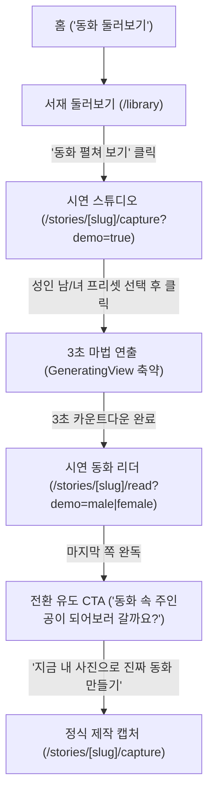

# 시연하기 인터랙티브 플로우 명세 (Demo Interactive Flow Spec)

> **최종 확정일**: 2026-09-18  
> **상태**: 확정 (Approved)  
> **관련 PR**: PR #68, PR #69 후속 작업

---

## 1. 개요 및 배경

### 1.1 현황과 한계
- **기존 시연**: 서재(`/library`)에서 '동화 펼쳐 보기'를 누르면 원본 템플릿 동화 리더(`/library/{slug}/1`)로 직행하여 텍스트와 원본 그림만 감상함.
- **문제점**: 서비스의 핵심 가치인 **"내 얼굴이 동화 속 주인공으로 합성되는 경험"**을 시연 단계에서 전혀 체감하지 못하여, 실제 제작 및 회원가입 전환율이 낮아지는 한계가 있음.

### 1.2 목표
- **실제 AI 비용 0원 유지**: 실시간 생성 API를 호출하지 않고 사전에 준비된 에셋과 무상태(Stateless) 파라미터로 동작.
- **카메라 권한 이탈 방지**: 카메라 권한을 요청하지 않고 완성도 높은 성인 남/녀 호감형 프리셋을 제공하여 진입 장벽 제거.
- **핵심 가치 체험 (10초 퍼널)**: [프리셋 선택 ➔ 3초 마법 연출 ➔ 주인공 합성 동화 감상 ➔ 정식 제작 전환 CTA]를 통해 사용자가 서비스의 매력을 즉각 체감하도록 개선.

---

## 2. 시연 인터랙티브 플로우 상세



---

### Step 1: 서재 둘러보기 (`/library`)
- **버튼 액션**: 시연 모드(`mode=create` 없음)에서 동화 카드의 **'동화 펼쳐 보기'** 클릭 시:
  - 목적지: **`/stories/${slug}/capture?demo=true`** 로 직행.
  - (제작 모드 `mode=create`인 경우는 기존과 동일하게 이미 만든 동화 유무에 따라 상세/촬영으로 분기)

---

### Step 2: 시연 스튜디오 (`/stories/[slug]/capture?demo=true`)
- **카메라 제어**: 카메라 권한을 요청하지 않으며 웹캠 스트림을 켜지 않음.
- **프리셋 선택 인터페이스**:
  - 뷰파인더 하단에 2개의 프로필 선택 카드 제공:
    1. 👨 **성인 남성**: 20대 중후반, 단정하고 다정한 호감형 인상
    2. 👩 **성인 여성 (단발머리)**: 20대 중후반, 턱선에 닿는 깔끔한 단발의 맑고 예쁜 호감형 인상
  - 기본 선택값: 첫 번째 프리셋(남성 또는 여성)이 자동 선택되어 뷰파인더에 표시.
- **안내 배너**:
  - *"시연용 샘플 주인공으로 3초 만에 나만의 동화를 체험해 보세요!"* 배너 노출.
- **하단 액션**:
  - `[ 이 얼굴로 동화 만들기 ]` 버튼 클릭 시 Step 3으로 이동.
  - 링크: `/stories/${slug}/read?demo=${selectedPreset}&loading=true`

---

### Step 3: 3초 마법 연출 (`GeneratingView` 시뮬레이션)
- **목적**: "사진이 동화로 변신하는 과정"의 설렘과 마법적 경험 제공.
- **동작 방식**:
  - 실제 백엔드 AI 생성 API를 호출하지 않음.
  - 프론트엔드 타이머(3초) 동안 동화적 마법 파티클 및 롤링 메시지 연출:
    - *"동화나라의 문을 똑똑 두드리고 있어요... ✨"*
    - *"주인공 마법을 가루처럼 뿌리는 중... 🪄"*
  - 3초 경과 즉시 자동으로 시연 동화 1쪽으로 매끄럽게 전환.

---

### Step 4: 시연 동화 리더 (`/stories/[slug]/read?demo=male|female`)
- **무상태(Stateless) 아키텍처**:
  - 백엔드 DB에 세션을 생성하지 않고, URL 쿼리(`demo=male` 또는 `demo=female`)를 통해 정적으로 렌더링.
  - 로그인 세션 만료나 DB 네트워크 장애와 무관하게 100% 안정적으로 서빙.
- **본문 삽화**:
  - 완성 합성 이미지 세트 준비 전까지: 원작 템플릿 기본 삽화를 베이스로 깔끔하게 렌더링.
  - 고품질 AI 합성 이미지 세트 준비 후: `apps/front/public/demo/stories/${slug}/${preset}/page-${pageNo}.webp` 경로로 즉시 교체 가능하도록 구조화.
- **오디오 & TTS**:
  - 템플릿 기본 오디오 및 나레이션 정상 재생 지원.
- **캐릭터 핫스팟 대화 (말풍선 채팅)**:
  - 외부 AI 모델(OpenRouter) API를 부르지 않고, 캐릭터 터치 시 사전 준비된 고정 대표 질답(1~2턴)이 즉각 튀어나오도록 처리 (비용 0원).

---

### Step 5: 완독 후 전환 유도 CTA (EndView)
- **노출 시점**: 동화 마지막 페이지(또는 낭독 종료 시).
- **카피라이팅**:
  - **헤드라인**: `"동화 속 주인공이 되어보러 갈까요? ✨"`
  - **서브텍스트**: `"단 한 장의 사진으로 세상에 하나뿐인 나만의 이야기를 만들어 보세요."`
  - **버튼 CTA**: `[ 지금 내 사진으로 진짜 동화 만들기 ]`
- **동작**:
  - 클릭 시 정식 제작 캡처 화면(`/stories/${slug}/capture`)으로 이동.
  - 비로그인 사용자는 로그인/회원가입 후 자연스럽게 제작 화면으로 유도.

---

## 3. 에셋 설계 및 디렉토리 구조

```text
apps/front/public/demo/
├── avatars/
│   ├── male.webp       # 호감형 성인 남성 정면 AI 실사 사진
│   └── female.webp     # 호감형 성인 여성 (단발머리) 정면 AI 실사 사진
└── stories/            # (추후 합성 이미지 세트 배치 슬롯)
    ├── jack-and-beanstalk/
    │   ├── male/       # 잭 남성 합성 삽화 (page-1 ~ 7.webp)
    │   └── female/     # 잭 여성 합성 삽화 (page-1 ~ 7.webp)
    └── red-riding-hood/
        ├── male/       # 빨간모자 남성 합성 삽화 (page-1 ~ 7.webp)
        └── female/     # 빨간모자 여성 합성 삽화 (page-1 ~ 7.webp)
```

---

## 4. 구현 태스크 체크리스트

- [ ] **에셋 생성**:
  - [ ] 호감형 성인 남성 정면 AI 실사 초상화 생성 (`male.webp`)
  - [ ] 호감형 성인 여성 (단발머리) 정면 AI 실사 초상화 생성 (`female.webp`)
- [ ] **서재 진입 연결**:
  - [ ] `LibraryStoryList.tsx` 및 `libraryMode.ts`에서 시연 모드 클릭 시 `/stories/${slug}/capture?demo=true` 라우팅 연동
- [ ] **시연 스튜디오 UI (`CaptureStudio.tsx`, `capture/page.tsx`)**:
  - [ ] `demo=true` 감지 시 카메라 권한 요청 차단 및 프리셋 선택 모드 전환
  - [ ] 남/녀 2종 선택 카드 탭 및 뷰파인더 프리뷰 연동
  - [ ] 시연 전용 안내 문구 적용 및 버튼 클릭 시 `/stories/${slug}/read?demo=${preset}&loading=true` 이동
- [ ] **3초 마법 연출 및 시연 리더 (`read/page.tsx`, `GeneratingView.tsx`)**:
  - [ ] `demo` 쿼리 파라미터 감지 시 3초 타이머 기반 `GeneratingView` 시뮬레이션 연동
  - [ ] `demo` 모드 시연 리더 렌더링 (Stateless 정적 데이터 매핑)
  - [ ] 시연 캐릭터 핫스팟 고정 질답 프리셋 연동
- [ ] **완독 후 전환 CTA (`EndView.tsx`)**:
  - [ ] `demo` 모드 전용 헤드라인("동화 속 주인공이 되어보러 갈까요? ✨") 및 버튼 노출
- [ ] **검증 및 테스트**:
  - [ ] 단위 테스트 작성 및 전체 패스 확인 (`pnpm --filter nerd-front test`)
  - [ ] 프로덕션 빌드 통과 (`pnpm --filter nerd-front build`)
