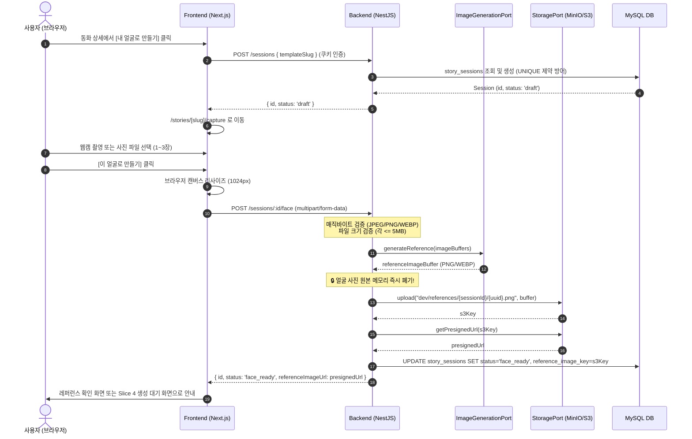

# Slice 3: 세션 관리 및 얼굴 등록 상세 설계서

> 작성일: 2026-09-08  
> 상태: **설계 확정 (Enacted via /grill-me)**  
> 작업 브랜치: `feat/my-story-slice-3`  
> 상위 문서: [`docs/tasks/tasks-my-story.md`](tasks-my-story.md)

---

## 1. 개요 및 목표

본 문서는 My Story 프로젝트의 **Slice 3 (세션 생성 및 얼굴 등록 → 레퍼런스 이미지 보관)** 구현을 위한 상세 기술 명세서다.

사용자가 동화를 선택하고 자신의 얼굴 사진을 제공하여 **개인화된 주인공 캐릭터 레퍼런스 1장**을 생성·보관하고, 이후 Slice 4의 비동기 6장 삽화 개인화 파이프라인으로 연결되는 기초 데이터를 확보하는 것을 목표로 한다.

---

## 2. 핵심 아키텍처 결정 사항 (ADR Summary)

| 항목 | 결정 사항 | 근거 및 구현 원칙 |
|---|---|---|
| **AI 이미지 모델** | **Port & Adapter (`ImageGenerationPort`)** | • 크레딧 충전 전까지 0원/0에러 테스트를 위해 **`MockImageAdapter`** 기본 활성화<br>• 추후 크레딧 충전 시 환경변수(`IMAGE_PROVIDER=openrouter`)로 즉시 스위칭 가능한 **`OpenRouterImageAdapter`** 병행 구축 |
| **얼굴 사진 입력 요건** | **정면 1장 필수 + 좌/우 선택 (1~3장 유연 지원)** | • 기존 3장 엄격 요건 완화 (사용자 편의성 제고 및 1장만으로도 생성 가능)<br>• 장당 최대 5MB, 매직바이트(JPEG/PNG/WEBP) 검증<br>• **개인정보 보호**: 레퍼런스 생성 즉시 원본 얼굴 사진은 메모리에서 즉시 폐기 (디스크/DB 미저장) |
| **프론트엔드 입력 UX** | **웹캠 실시간 촬영 + 사진 파일 첨부 동시 지원** | • 웹캠 실시간 뷰파인더(`getUserMedia` + 원형 오버레이 가이드) 제공<br>• 카메라 불가 환경 및 기존 앨범 사진을 위한 '파일 첨부' fallback 동시 제공<br>• 업로드 전 브라우저 캔버스 리사이즈 (1024x1024 이하) |
| **스토리지 및 데이터 격리** | **S3 호환 `StoragePort` + `dev/` prefix 격리** | • 운영 환경 MinIO(S3 API)와 호환되는 `@aws-sdk/client-s3` 기반 구현<br>• 개발 데이터가 운영 데이터와 섞이지 않도록 S3 키에 `dev/` 네임스페이스 적용<br>• 클라이언트는 서명 URL(Presigned URL)로 스토리지 직접 조회 |
| **세션 멱등성 및 1권 제한** | **`UNIQUE(user_id, template_id)` + 미완료 세션 재사용** | • 1인당 동화 템플릿 1회 생성 상한 유지<br>• 이미 완성된 세션(`completed`)은 `409 Conflict`<br>• 미완료 세션(`draft`, `failed`)은 새 세션을 만들지 않고 기존 세션을 반환해 재촬영/재시도 보장 |

---

## 3. 데이터 흐름 (Sequence Diagram)



---

## 4. 데이터 모델 설계

### 4.1. `story_sessions` 엔티티

```typescript
@Entity('story_sessions')
@Unique('uq_story_sessions_user_template', ['userId', 'templateId'])
export class StorySessionEntity {
  @PrimaryGeneratedColumn('uuid')
  id: string;

  @Column({ name: 'user_id', type: 'varchar', length: 36 })
  userId: string;

  @Column({ name: 'template_id', type: 'varchar', length: 36 })
  templateId: string;

  @Column({
    type: 'enum',
    enum: ['draft', 'face_ready', 'generating', 'completed', 'failed'],
    default: 'draft',
  })
  status: 'draft' | 'face_ready' | 'generating' | 'completed' | 'failed';

  @Column({ name: 'reference_image_key', type: 'varchar', length: 255, nullable: true })
  referenceImageKey: string | null;

  @CreateDateColumn({ name: 'created_at', type: 'datetime', precision: 3 })
  createdAt: Date;

  @UpdateDateColumn({ name: 'updated_at', type: 'datetime', precision: 3 })
  updatedAt: Date;

  @ManyToOne(() => UserEntity, { onDelete: 'CASCADE' })
  @JoinColumn({ name: 'user_id' })
  user: UserEntity;

  @ManyToOne(() => StoryTemplateEntity, { onDelete: 'CASCADE' })
  @JoinColumn({ name: 'template_id' })
  template: StoryTemplateEntity;
}
```

---

## 5. API 계약 명세 (`packages/contracts`)

### 5.1. `POST /sessions` (세션 생성/재사용)
* **요청 본문**:
  ```typescript
  export const CreateSessionRequestSchema = z.object({
    templateSlug: z.string().min(1).max(100),
  });
  ```
* **응답 본문**:
  ```typescript
  export const CreateSessionResponseSchema = z.object({
    id: z.string().uuid(),
    status: z.enum(['draft', 'face_ready', 'generating', 'completed', 'failed']),
    templateSlug: z.string(),
    referenceImageUrl: z.string().url().optional(),
    createdAt: z.string(),
  });
  ```
* **오류 응답**:
  * `401 Unauthorized`: 로그인 필요
  * `404 Not Found`: 존재하지 않는 `templateSlug`
  * `409 Conflict`: 이미 완료(`completed`)된 동화 (`CODE: STORY_ALREADY_COMPLETED`)

### 5.2. `POST /sessions/:id/face` (얼굴 업로드 & 레퍼런스 생성)
* **요청 형태**: `multipart/form-data`
  * `front`: 이미지 파일 (필수)
  * `left`: 이미지 파일 (선택)
  * `right`: 이미지 파일 (선택)
* **서버 검증 규칙**:
  * 각 파일 크기: 최대 5MB (`5 * 1024 * 1024`)
  * 매직 바이트 검증: JPEG (`FF D8 FF`), PNG (`89 50 4E 47`), WEBP (`52 49 46 46 ... 57 45 42 50`)
* **응답 본문**:
  ```typescript
  export const UploadFaceResponseSchema = z.object({
    id: z.string().uuid(),
    status: z.literal('face_ready'),
    referenceImageUrl: z.string().url(),
  });
  ```
* **오류 응답**:
  * `400 Bad Request`: 필수 파일 누락, 매직바이트 불일치, 파일 크기 초과
  * `403 Forbidden`: 본인 소유가 아닌 세션에 업로드 시도
  * `404 Not Found`: 존재하지 않는 세션

---

## 6. 인터페이스 명세 (`apps/back/src/common/port`)

### 6.1. `ImageGenerationPort`
```typescript
export interface GenerateReferenceInput {
  front: Buffer;
  left?: Buffer;
  right?: Buffer;
}

export interface ImageGenerationPort {
  generateReference(input: GenerateReferenceInput): Promise<Buffer>;
}
```

* **`MockImageAdapter`**: 사전 정의된 주인공 SVG/PNG fixture 버퍼를 반환하여 0원/0딜레이로 테스트 가능.
* **`OpenRouterImageAdapter`**: OpenRouter의 멀티모달 이미지 생성 모델(`google/gemini-3.1-flash-image` 등) 호출.

### 6.2. `StoragePort`
```typescript
export interface StoragePort {
  upload(key: string, buffer: Buffer, mimeType: string): Promise<string>;
  getPresignedUrl(key: string, expiresInSeconds?: number): Promise<string>;
  delete(key: string): Promise<void>;
}
```

* **`S3StorageAdapter`**: `@aws-sdk/client-s3` 및 `@aws-sdk/s3-request-presigner` 사용.
* **환경변수 분리**:
  * `S3_ENDPOINT`: 내부 접근용 (예: `http://localhost:9000` 또는 Docker 서비스명)
  * `S3_PUBLIC_URL`: 서명 URL 발급용 (브라우저 접근 호스트)
  * `S3_BUCKET_NAME`: 버킷명 (기본 `nerd-storage`)
  * `STORAGE_KEY_PREFIX`: `dev/` (로컬/테스트 환경 격리용)

---

## 7. 검증 계획

1. **단위 테스트 (Unit Tests)**:
   * 파일 매직바이트 검증기 (위조 확장자 거부, 정상 이미지 통과)
   * `StorySessionService` 세션 생성, 1인 1권 409 제약, 미완료 세션 재사용
   * `MockImageAdapter` 및 `S3StorageAdapter` 서명 URL 생성
2. **E2E 테스트 (E2E Tests)**:
   * `POST /sessions` 로그인 여부에 따른 401 및 정상 발급
   * `POST /sessions/:id/face` multipart 유효성 검증 및 201 응답
3. **CI 파이프라인**:
   * `pnpm back ci:core`
   * `pnpm front ci:core`
   * `pnpm ci:core`
