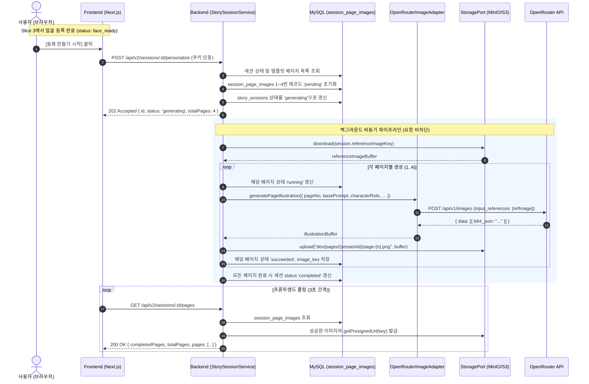

# Slice 4: 동화 삽화 개인화 파이프라인 및 OpenRouter AI 연동 상세 설계서

> 작성일: 2026-09-08  
> 상태: **구현 완료 및 검증 통과 (Backend & Contracts Ready)**  
> 작업 브랜치: `feat/my-story-slice-4-ai`  
> 상위 문서: [`docs/tasks/tasks-my-story.md`](tasks-my-story.md)

---

## 1. 개요 및 목표

본 문서는 My Story 프로젝트의 **Slice 4 (동화 페이지 삽화 개인화 비동기 파이프라인 및 OpenRouter AI 모델 연동)**의 상세 기술 명세서다.

사용자가 Slice 3에서 등록한 **주인공 캐릭터 레퍼런스 이미지 1장**과 동화 템플릿의 **각 페이지별 장면 프롬프트(StoryPage)**를 결합하여, 동화 본편(1~4페이지)의 개인화된 고품질 삽화를 비동기로 생성·저장·서빙하고 실패한 페이지를 개별 재시도할 수 있는 백엔드 인프라 및 API 계약을 정의한다.

---

## 2. 핵심 아키텍처 결정 사항 (ADR Summary)

| 항목 | 결정 사항 | 근거 및 구현 원칙 |
|---|---|---|
| **AI 이미지 생성 표준** | **OpenRouter 공식 Unified Image API (`POST /api/v1/images`)** | • OpenRouter는 이미지 생성 전용 엔드포인트(`https://openrouter.ai/api/v1/images`)를 사용함<br>• 주인공 레퍼런스 이미지는 `input_references`에 base64 data URL 형태로 전달하여 캐릭터 외형 일관성 유지<br>• 가성비 모델 기본화(`bytedance-seed/seedream-5-0-lite`: 장당 $0.035, 레퍼런스 참조 무료)<br>• 환경변수 `OPENROUTER_IMAGE_MODEL`로 모델 자유 변경 지원 |
| **0원 테스트 보장** | **Dual Adapter (`MockImageAdapter` + `OpenRouterImageAdapter`)** | • 크레딧 충전 전 또는 CI 환경에서는 `IMAGE_PROVIDER=mock`으로 0원/0초 테스트 가능 (스토리북 SVG 동적 렌더링)<br>• 크레딧 충전 후 `.env`에서 `IMAGE_PROVIDER=openrouter`로 설정 시 코드 변경 없이 즉시 실제 AI 생성 전환 |
| **비동기 롱러닝 처리** | **202 Accepted + 클라이언트 폴링 (3초 간격)** | • 이미지 생성은 장당 5~15초가 소요되는 고비용 I/O 작업으로 HTTP 동기 블로킹 금지<br>• API 10(`POST /personalize`)은 202 Accepted로 즉시 응답하고 백그라운드 파이프라인 기동<br>• API 11(`GET /pages`)로 진행 상태(`pending`, `running`, `succeeded`, `failed`) 및 presigned URL 폴링 |
| **부분 실패 허용 및 핀포인트 재시도** | **`session_page_images` 엔티티 + API 12 (`retryPage`)** | • 전체 페이지 중 1개 페이지만 실패(429 또는 AI 에러)했을 때 전체 동화를 처음부터 다시 만들지 않음<br>• `session_page_images` 테이블에 페이지별 상태 격리<br>• 실패한 페이지만 핀포인트로 재시도하여 불필요한 AI 크레딧 낭비 방지 |
| **멱등성 및 동시성 보호** | **`UNIQUE(session_id, page_no)` 제약** | • 동일 세션의 동일 페이지에 대한 중복 생성 방지<br>• 이미 `generating` 또는 `completed`인 세션에 대해 `POST /personalize` 호출 시 중복 작업 없이 현재 상태 반환 |

---

## 3. 데이터 흐름 (Sequence Diagram)



---

## 4. 데이터베이스 스키마 (`session_page_images`)

```sql
CREATE TABLE IF NOT EXISTS `session_page_images` (
  `id` VARCHAR(36) NOT NULL,
  `session_id` VARCHAR(36) NOT NULL,
  `page_no` SMALLINT UNSIGNED NOT NULL,
  `status` ENUM('pending', 'running', 'succeeded', 'failed') NOT NULL DEFAULT 'pending',
  `image_key` VARCHAR(512) NULL,
  `error_message` VARCHAR(512) NULL,
  `created_at` DATETIME(3) NOT NULL DEFAULT CURRENT_TIMESTAMP(3),
  `updated_at` DATETIME(3) NOT NULL DEFAULT CURRENT_TIMESTAMP(3) ON UPDATE CURRENT_TIMESTAMP(3),
  PRIMARY KEY (`id`),
  UNIQUE KEY `uq_session_page_images_session_page` (`session_id`, `page_no`),
  CONSTRAINT `fk_session_page_images_session` FOREIGN KEY (`session_id`) REFERENCES `story_sessions` (`id`) ON DELETE CASCADE
) ENGINE=InnoDB DEFAULT CHARSET=utf8mb4 COLLATE=utf8mb4_0900_ai_ci;
```

---

## 5. API 명세

### API 10: `POST /api/v2/sessions/:id/personalize`
- **목적**: 동화 삽화 개인화 백그라운드 파이프라인 기동 (202 Accepted)
- **인증**: 필요 (HttpOnly 세션 쿠키)
- **전제조건**: 세션 상태가 `face_ready` 또는 `failed`이어야 함 (`draft` 상태인 경우 `400 FACE_NOT_READY` 에러 반환)
- **멱등성**: 이미 `generating` 또는 `completed`인 경우 기존 상태 즉시 반환
- **성공 응답**:
  ```json
  {
    "code": "SUCCESS",
    "data": {
      "id": "session-uuid",
      "status": "generating",
      "totalPages": 4
    },
    "message": "개인화 생성이 시작되었습니다."
  }
  ```

### API 11: `GET /api/v2/sessions/:id/pages`
- **목적**: 페이지별 진행 상태 및 생성 완료된 서명 URL 목록 조회 (클라이언트 폴링용)
- **성공 응답**:
  ```json
  {
    "code": "SUCCESS",
    "data": {
      "sessionId": "session-uuid",
      "status": "generating",
      "totalPages": 4,
      "completedPages": 2,
      "isAllCompleted": false,
      "pages": [
        {
          "pageNo": 1,
          "status": "succeeded",
          "imageUrl": "https://storage.local/pages/session-uuid/page-1.png?...",
          "errorMessage": null,
          "updatedAt": "2026-09-08T06:00:00.000Z"
        },
        {
          "pageNo": 2,
          "status": "running",
          "imageUrl": null,
          "errorMessage": null,
          "updatedAt": "2026-09-08T06:00:05.000Z"
        }
      ]
    },
    "message": "페이지 진행 상태를 조회했습니다."
  }
  ```

### API 12: `POST /api/v2/sessions/:id/pages/:pageNo/retry`
- **목적**: 특정 실패한 페이지만 단독 재시도
- **성공 응답**:
  ```json
  {
    "code": "SUCCESS",
    "data": {
      "sessionId": "session-uuid",
      "pageNo": 2,
      "status": "pending",
      "message": "2페이지 재생성이 시작되었습니다."
    },
    "message": "페이지 재시도가 시작되었습니다."
  }
  ```

---

## 6. OpenRouter AI 모델 및 크레딧 비용 안내

- **OpenRouter 엔드포인트**: `https://openrouter.ai/api/v1/images`
- **추천 모델**:
  1. `bytedance-seed/seedream-5-0-lite` (기본값):
     - 장당 약 **$0.035** (~47원)
     - `input_references` 지원 및 아동 동화 일러스트 풍 우수
     - $5 충전 시 약 **140장** 이상 생성 가능 (동화 35권 분량)
  2. `black-forest-labs/flux.2-klein-4b`:
     - 메가픽셀당 **$0.014** (~18원)
     - 최고 가성비, 초고속 생성
- **스위칭 방법**:
  - 개발 환경(`IMAGE_PROVIDER=mock`): 비용 0원, 즉시 SVG 생성
  - 운영/테스트 환경(`IMAGE_PROVIDER=openrouter`): 크레딧 충전 후 `.env`에 `OPENROUTER_API_KEY`와 `OPENROUTER_IMAGE_MODEL`을 설정하면 즉시 실연동
